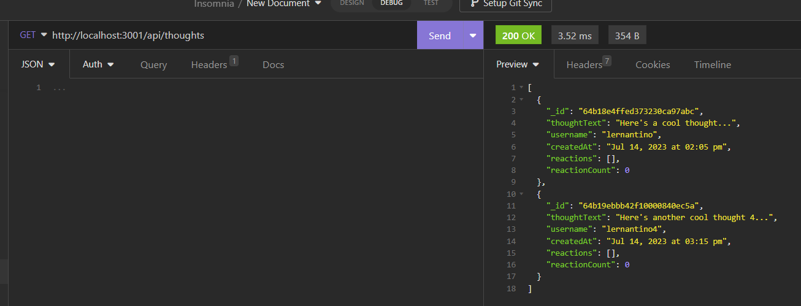

# <Social-Network-Api>

## Description

This project is a simple API for a social networking app using MongoDB! Feel free to clone this repo and test the endpoints in Insomnia!

Walkthrough video testing endpoints: 
https://drive.google.com/file/d/1vmiJtqY9kQtIP1oaF6miozJv-BDaJZdB/view

Screenshot of sample endpoint testing: 

## Installation

What are the steps required to install your project? Provide a step-by-step description of how to get the development environment running.

## Usage

Provide instructions and examples for use. Include screenshots as needed.

To add a screenshot, create an assets/images folder in your repository and upload your screenshot to it. Then, using the relative file path, add it to your README using the following syntax:

## Credits

Columbia University Coding Bootcamp

404 Photo by <a href="https://unsplash.com/fr/@cookiethepom?utm_source=unsplash&utm_medium=referral&utm_content=creditCopyText">Cookie the Pom</a> on <a href="https://unsplash.com/photos/gySMaocSdqs?utm_source=unsplash&utm_medium=referral&utm_content=creditCopyText">Unsplash</a>

## License

MIT License

---

## Badges

Badges aren't necessary, but they demonstrate street cred. Badges let other developers know that you know what you're doing. Check out the badges hosted by [shields.io](https://shields.io/). You may not understand what they all represent now, but you will in time.

## How to Contribute

Follow the [Contributor Covenant](https://www.contributor-covenant.org/)!
